# 🚀 Mystry Message – Gather Honest Reviews with Privacy!

## 📌 Overview
The Mystry Message App allows users to sign up with their Gmail accounts and verify their identity through a one-time password (OTP) sent via email. Once verified, users receive a unique public link to collect anonymous feedback or reviews securely.

## 🔹 Key Features
- ✅ **Secure Sign-up & OTP Verification** – Ensures account authenticity using email verification.
- ✅ **Anonymous Feedback** – Users can receive honest opinions while keeping the sender's identity private.
- ✅ **Real-time Dashboard** – Displays feedback messages with timestamps, without revealing sender details.
- ✅ **User Authentication** – Users can log out anytime and easily sign back in.

This app is designed to help individuals, professionals, and businesses collect genuine feedback without privacy concerns.

---

## Screenshots

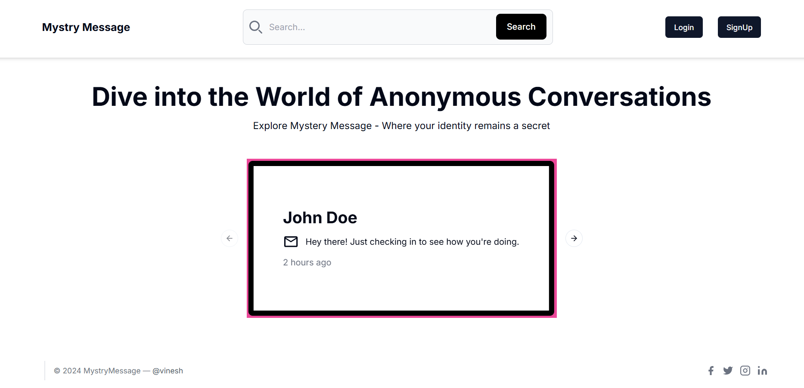

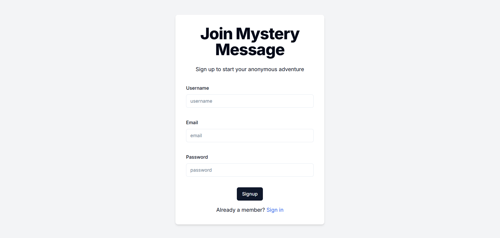

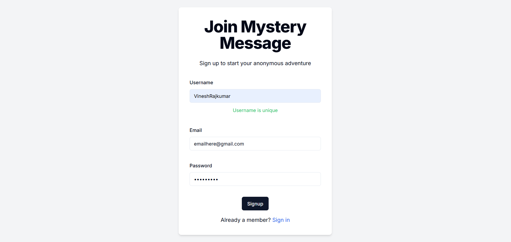

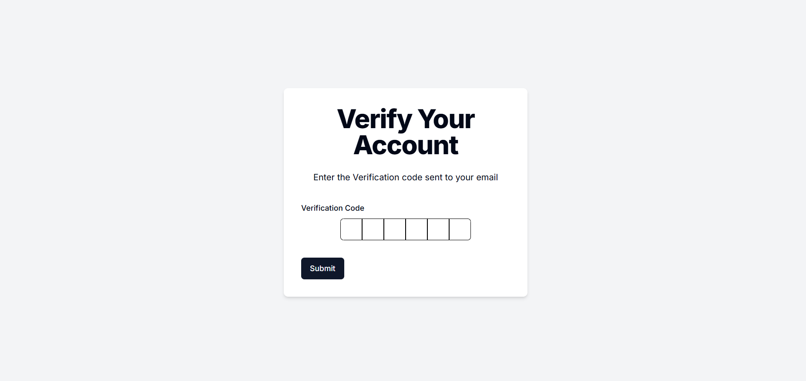

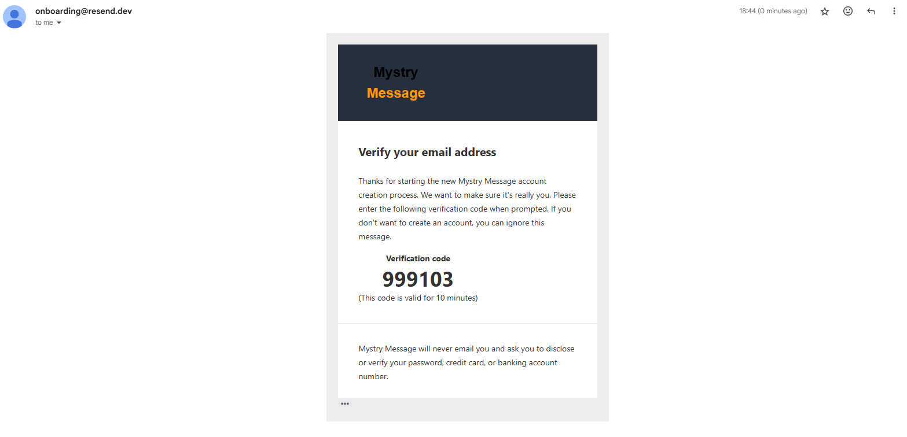

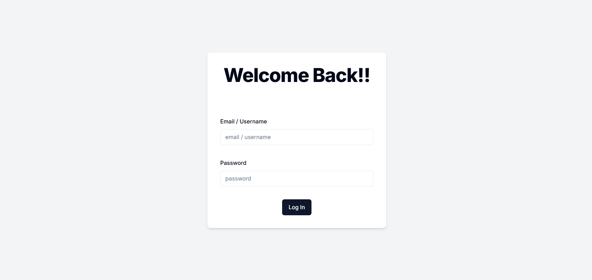

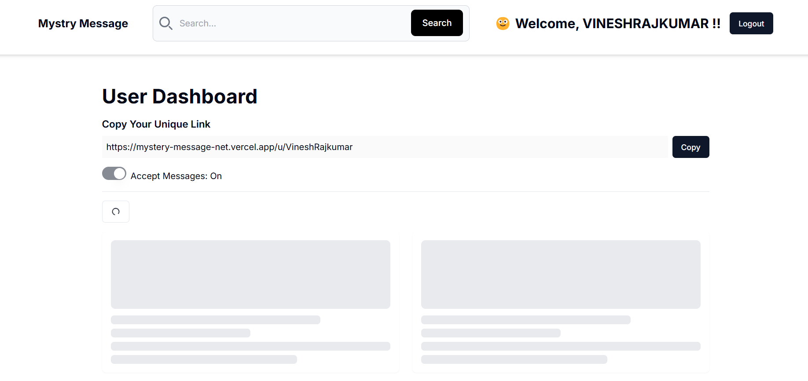

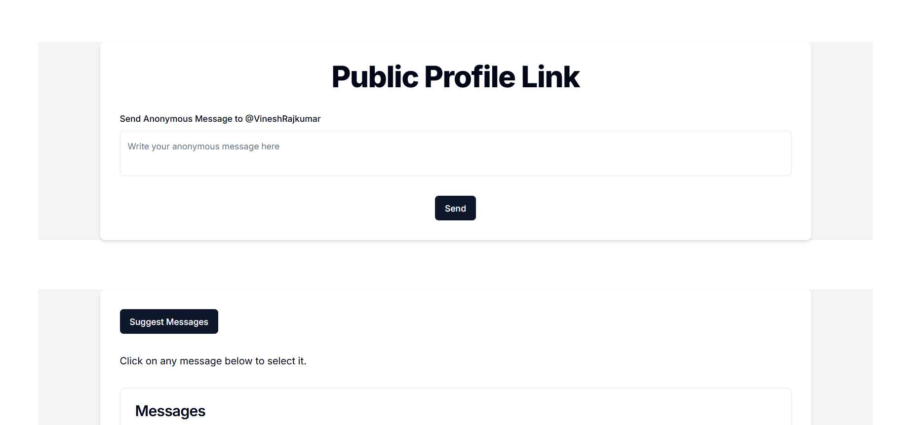

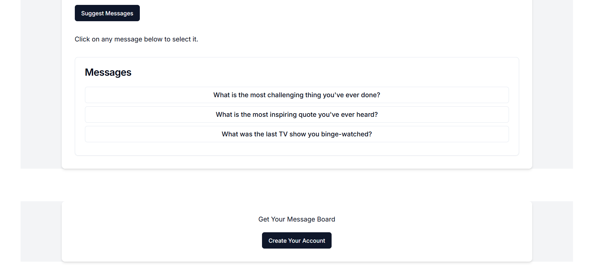

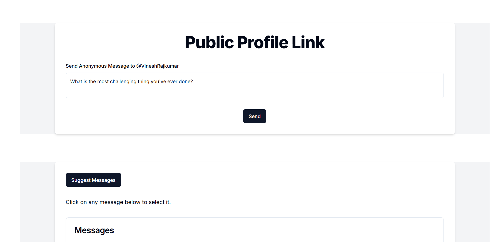

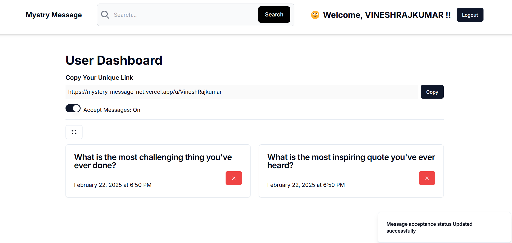

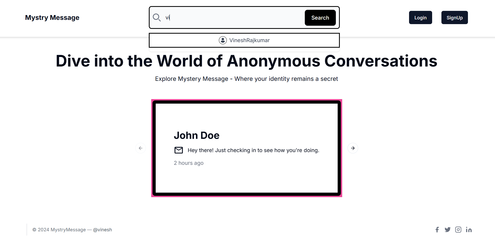

---

## 🛠️ Tech Stack & Libraries Used

### **Backend & Database**
- **Next.js** 
- **MongoDB & Mongoose** 
- **Aggregation Pipeline (MongoDB)** 

### **Authentication & Security**
- **NextAuth.js** 
- **bcryptjs** 

### **Validation & Parsing**
- **Zod** 
- **Regexr (Regex)** 

### **Email Integration**
- **Resend Email Library** 
- **React-Email Library** 

### **Frontend & UI**
- **ShadCN** 
- **Tailwind CSS** 

---

## ⚙️ Installation & Setup
### **1. Clone the Repository**
```sh
git clone https://github.com/VineshRajkumar/MysteryMessage.git
cd MysteryMessage
```

### **2. Install Dependencies**
```sh
npm install
```

### **3. Set Up Environment Variables**
Create a `.env` file and configure the required API keys and credentials:
```env
MONGODB_URI=your_mongodb_connection_string
NEXTAUTH_SECRET=your_nextauth_secret
RESEND_API_KEY=your_resend_api_key
GROQ_API_KEY=your_groq_api_key
NEXTAUTH_URL=http://localhost:3000
```

### **4. Run the Development Server**
```sh
npm run dev
```
Visit `http://localhost:3000` to view the application.

---

## 📖 How to Use
1. **Sign Up/Login**
   - Sign up using your Gmail account.
   - Verify your account by entering the OTP sent to your email.
2. **Share Feedback Link**
   - Once verified, you will receive a unique public link.
   - Share this link with others to collect anonymous feedback.
3. **View Feedback**
   - Access your real-time dashboard to view feedback messages with timestamps.
   - Feedback is displayed anonymously without revealing sender details.
4. **Manage Your Account**
   - Log out anytime and sign back in to access your dashboard.

---

## 📚 What I Learned
- **Next.js Authentication** – Gained hands-on experience integrating authentication using NextAuth.js with Gmail login.
- **MongoDB Aggregation Pipeline** – Used advanced aggregation queries for filtering and transforming data efficiently.
- **OTP-Based Email Verification** – Implemented OTP authentication using Resend for secure user verification.
- **Anonymous Feedback Handling** – Designed a system ensuring privacy while maintaining structured feedback storage.
- **UI Design with ShadCN & Tailwind CSS** – Improved UI/UX design skills using modern component libraries and utility-based styling.
- **Environment Variables & Deployment** – Learned to manage secrets with `.env` and deploy securely on Vercel.

---

## Authors

- [VineshRajkumar](https://github.com/VineshRajkumar)


